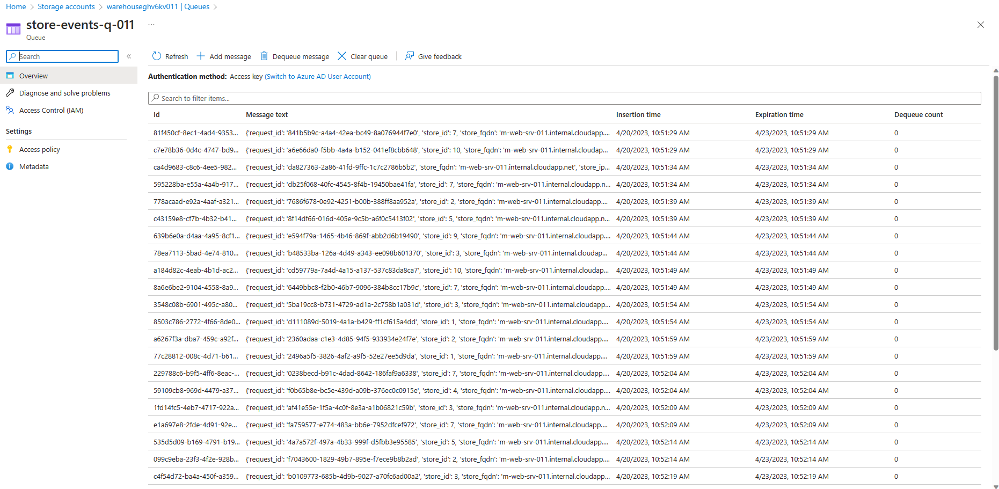
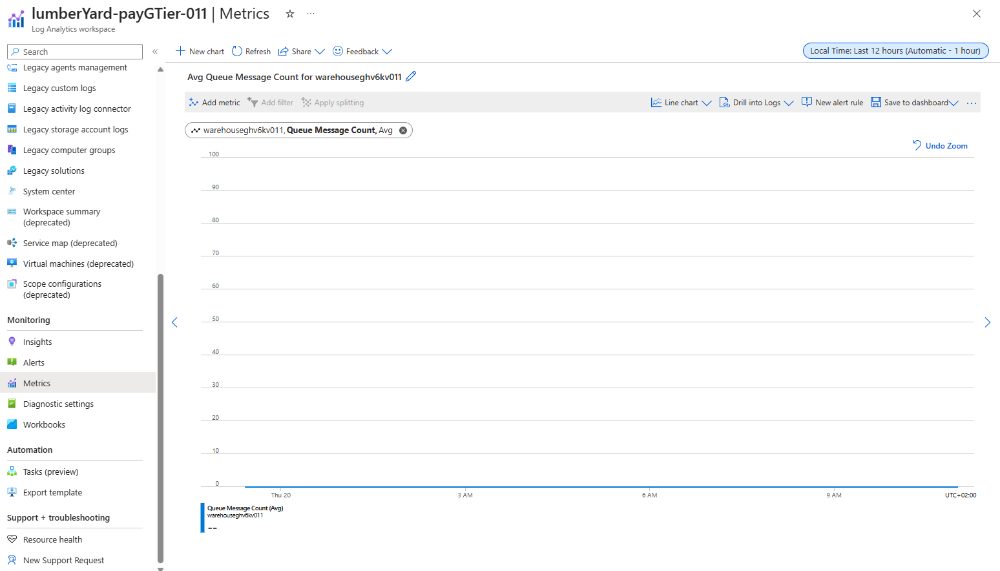

# Auto Scaling Azure VM(ScaleSets) in response to events

The developer at Mystique Unicorn are building their application using event-driven architectural pattern to process streaming data. In this application, they will have their physical stores, send a stream sales and inventory related events to a central location, where multiple downstream systems will consume these events. They are looking to scale their event consumers running in Azure VM Scale Sets when their Azure Storage queue length increases. 

They heard that Azure offers capabilities to build event-driven architectures using kubernetes, Can you show them how they can get started?

## 🎯 Solutions

We can configure autoscaling to Azure VMSS<sup>[1]</sup> to increase or decrease the VMsin response to events. In this particular case, we can to scale based on Storage Message Queue Length. As of now[Q2-2023], the granularity supported by Azure is at Storage Account level and not at individual Storage Queue Level<sup>[2]</sup>. So, this means we will have to restrict the storage account to only one queue to make this work. Lets assume this is acceptable in a parallel universe and continue.


While building this solution, I have used other anamolies that created challenges in implementing this solution. I have documented them in the [Anamolies](#-anamolies) section. 

## 📝 Anamolies
   - **Azure Monitor Storage Account Metrics** - The granularity of Storage Queue Metrics is at storage account level and not at individual resource level <sup>[3],[4],[5]</sup> as a metric. 
   - **Azure Monitor Metric Update Frequency** - `QueueMessageCount` is platform metric<sup>[5]</sup>. The update frequency is supposedly `1` minute<sup>[6]</sup>. 
   
        _Excerpt from the docs_<sup>[5]</sup>
    
        >This article is a complete list of all platform (that is, automatically collected) metrics currently available with the consolidated metric pipeline in Azure Monitor.

        _Excerpt from the docs_<sup>[6]</sup>
    
        >Platform metrics are collected from Azure resources at **one-minute** frequency unless specified otherwise in the metric's definition.

      The best practices for monitoring Azure Queue Storage<sup>[7]</sup> informs that this is metric is refreshed daily.

        _Excerpt from the docs_<sup>[7]</sup>
    
        >You can monitor the message count for all queues in a storage account by using the QueueMessageCount metric. This metric is **refreshed daily**.
   
   
      StackOverflow<sup>[8]</sup> has highlighted the issue. My own testing shows that the metric is not updated even after every few hours.
      
      

      Using the Ptyhon SDK, I have tested the queue lenght update frequency.

      ```py
      import os
      import time
      from azure.identity import DefaultAzureCredential
      from azure.storage.queue import QueueServiceClient

      Q_NAME="store-events-q-011"
      SA_NAME = os.getenv("SA_NAME", "warehouseghv6kv011")
      Q_SVC_ACCOUNT_URL=f"https://{SA_NAME}.queue.core.windows.net"

      credential = DefaultAzureCredential(logging_enable=False)
      q_svc_client = QueueServiceClient(Q_SVC_ACCOUNT_URL, credential=credential)

      q_client = q_svc_client.get_queue_client(Q_NAME)

      for num in range(1, 11):
          properties = q_client.get_queue_properties()
          count = properties.approximate_message_count
          print("Current Message count: " + str(count))
          time.sleep(10)
      ```
      _Output: As we can observe the # of messages keep increasing every `10` seconds_
      ```bash
      Tuple timeout setting is deprecated
      Current Message count: 2973
      Tuple timeout setting is deprecated
      Current Message count: 2977
      Tuple timeout setting is deprecated
      Current Message count: 2981
      Tuple timeout setting is deprecated
      Current Message count: 2985
      Tuple timeout setting is deprecated
      Current Message count: 2989
      Tuple timeout setting is deprecated
      Current Message count: 2993
      Tuple timeout setting is deprecated
      Current Message count: 2997
      Tuple timeout setting is deprecated
      Current Message count: 3001
      Tuple timeout setting is deprecated
      Current Message count: 3005
      Tuple timeout setting is deprecated
      Current Message count: 3009
      ```

      
1. ## 📒 Conclusion

    Here we have demonstrated how to store use Azure Storage Queue to publish and subscribe to events. You can extend the solution to setup trigger in blob conatiners to further process these events or notify other consumers.
  

1. ## 🧹 CleanUp

If you want to destroy all the resources created by the stack, Execute the below command to delete the stack, or _you can delete the stack from console as well_

- Resources created during [Deploying The Application](#-deploying-the-application)
- _Any other custom resources, you have created for this demo_

```bash
# Delete from resource group
az group delete --name Miztiik_Enterprises_xxx --yes
# Follow any on-screen prompt
```

This is not an exhaustive list, please carry out other necessary steps as maybe applicable to your needs.

## 📌 Who is using this

This repository aims to show how to use Azure with Iac(Bicep) to new developers, Solution Architects & Ops Engineers in Azure.

### 💡 Help/Suggestions or 🐛 Bugs

Thank you for your interest in contributing to our project. Whether it is a bug report, new feature, correction, or additional documentation or solutions, we greatly value feedback and contributions from our community. [Start here](/issues)

### 👋 Buy me a coffee

[](https://ko-fi.com/Q5Q41QDGK) Buy me a [coffee ☕][900].

### 📚 References


1. [Azure Docs: Autoscale for VMSS][1]
1. [Azure Docs: Custom Autoscale for VMSS with Resource Metrics][2]
1. [Azure Docs: Monitoring Azure Queue Storage][3]
1. [Azure Docs: Queue Storage monitoring data reference][4]
1. [Azure Docs: Supported metrics with Azure Monitor - Queue Storage][5]
1. [Azure Docs: Supported metrics with Azure Monitor - Queue Storage Data Collection][6]
1. [Azure Docs: Best practices for monitoring Azure Queue Storage][7]
1. [StackOverflow: How frequently are the Azure Storage Queue metrics updated][8]
1. [Azure Docs: Configure pythong logging in the Azure libraries][9]


### 🏷️ Metadata


**Level**: 300

[1]: https://learn.microsoft.com/en-us/azure/virtual-machine-scale-sets/virtual-machine-scale-sets-autoscale-overview
[2]: https://learn.microsoft.com/en-us/azure/virtual-machine-scale-sets/virtual-machine-scale-sets-autoscale-overview#metric-sources
[3]: https://learn.microsoft.com/en-us/azure/storage/queues/monitor-queue-storage
[4]: https://learn.microsoft.com/en-us/azure/storage/queues/monitor-queue-storage-reference
[5]: https://learn.microsoft.com/en-us/azure/azure-monitor/essentials/metrics-supported#microsoftstoragestorageaccountsqueueservices
[6]: https://learn.microsoft.com/en-us/azure/azure-monitor/essentials/data-platform-metrics#data-collection
[7]: https://learn.microsoft.com/en-us/azure/storage/queues/queues-storage-monitoring-scenarios
[8]: https://stackoverflow.com/questions/67560805/how-frequently-are-the-azure-storage-queue-metrics-updated
[9]: https://learn.microsoft.com/en-us/azure/developer/python/sdk/azure-sdk-logging

[100]: https://www.udemy.com/course/aws-cloud-security/?referralCode=B7F1B6C78B45ADAF77A9
[101]: https://www.udemy.com/course/aws-cloud-security-proactive-way/?referralCode=71DC542AD4481309A441
[102]: https://www.udemy.com/course/aws-cloud-development-kit-from-beginner-to-professional/?referralCode=E15D7FB64E417C547579
[103]: https://www.udemy.com/course/aws-cloudformation-basics?referralCode=93AD3B1530BC871093D6
[899]: https://www.udemy.com/user/n-kumar/
[900]: https://ko-fi.com/miztiik
[901]: https://ko-fi.com/Q5Q41QDGK