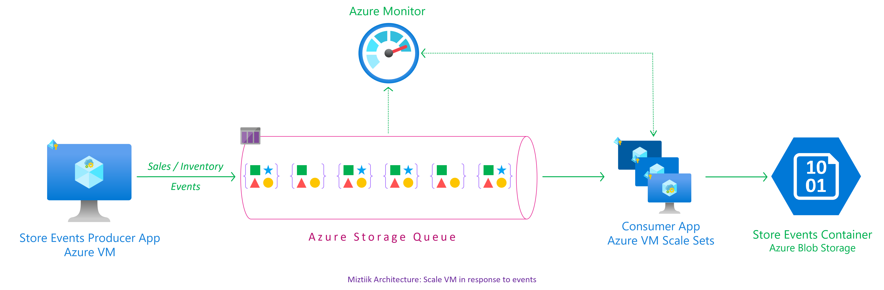

# Publish & Subscribe with Azure Storage Queues

The developer at Mystique Unicorn are interested in building their application using event-driven architectural pattern to process streaming data. For those who are unfamiliar, An event-driven architecture uses events to trigger and communicate between decoupled services and is common in modern applications built with microservices. An event is a change in state, or an update, like an item being placed in a shopping cart on an e-commerce website.

In this application, they will have their physical stores, send a stream sales and inventory related events to a central location, where multiple downstream systems will consume these events. For example, An event for a new order will be consumed by the warehouse system and the sales events will be used by the marketing department to generate revenue and forecast reports. This pattern of separating the produce, router and consumer to independent components allows them to scale the applications without constraints.

They heard that Azure offers capabilities to build event-driven architectures using kubernetes, Can you show them how they can get started? 

## 🎯 Solutions

We can have our producers leverage Azure Storage Queue<sup>[1]</sup> to persist the store event messages. The consumers can process them at their own pace. The producers can also set the `time-to-live` on the messages for time sensitive messages. But remember that Azure Storage Queue does not gurantee FIFO(aka First In, First out) ordering of messages. We will use the Azure Python SDK<sup>[2],[6],[7],[8]</sup> for producing and consuming our messages. We will control access to your queue using RBAC for queue<sup>[3]




1. ## 🧰 Prerequisites

   This demo, instructions, scripts and bicep template is designed to be run in `westeurope`. With few or no modifications you can try it out in other regions as well(_Not covered here_).

   - 🛠 Azure CLI Installed & Configured - [Get help here](https://learn.microsoft.com/en-us/cli/azure/install-azure-cli)
   - 🛠 Bicep Installed & Configured - [Get help here](https://learn.microsoft.com/en-us/azure/azure-resource-manager/bicep/install)
   - 🛠 VS Code & Bicep Extenstions - [Get help here](https://learn.microsoft.com/en-us/azure/azure-resource-manager/bicep/install#vs-code-and-bicep-extension)

1. ## ⚙️ Setting up the environment

   - Get the application code

     ```bash
     git clone https://github.com/miztiik/azure-vm-to-storage-queue
     cd azure-vm-to-storage-queue
     ```

1. ## 🚀 Prepare the environment

   Let check you have Azure Cli working with 

    ```bash
      # You should have azure cli preinstalled
      az account show
    ```

    You should see an output like this,

   ```json
    {
      "environmentName": "AzureCloud",
      "homeTenantId": "16b30820b6d3",
      "id": "1ac6fdbff37cd9e3",
      "isDefault": true,
      "managedByTenants": [],
      "name": "YOUR-SUBS-NAME",
      "state": "Enabled",
      "tenantId": "16b30820b6d3",
      "user": {
        "name": "miztiik@",
        "type": "user"
      }
    }
   ```

1. ## 🚀 Deploying the application

   Let us walk through each of the stacks,

   - **Stack: Main Bicep**
     The params required for the modules are in `params.json`. Do modify them to suit your need.(_Especially the `adminPassword.secureString` for the VM. You are strongly encouraged to Just-In-Time access<sup>[5]</sup> or use SSH key instead of password based authentication_). The helper deployment script `deploy.sh` will deploy the `main.bicep` file. This will create the following resoureces
     - Resource Group(RG)
     - VNet, Subnet & Virtual Machine
     - Virtual Machine(Ubuntu)
        - Bootstrapped with custom libs using `userData` script.
     - Storage Account - `warehouseXXXX`
        - Blob Container - `store-events-blob-xxx`
        - Storage Queue - `store-events-q-xxx`
      - App Config
        - The application configs to be used by producers & consumers
          - Storage account, Blob Name, Queue Name
     - User Managed Identity
        - Scoped with contributor privileges with conditional access restricting to a Blob, Queue & App Config
        - Identity attached to the VM
      - Log Anayltics Workspace
        - Data Collection Endpoint
        - Data Collection Rule
          - Attached to VM

      ```bash
      sh deploy.sh
      ```

     After successfully deploying the stack, Check the `Resource Groups/Deployments` section for the resources.


1. ## 🔬 Testing the solution

   - **Connect to the VM**

      The Ubuntu vm _should_ be bootstrapped using `userData` to install python3, git and also Azure SDK for Idenity, Blob & Queue.
      - Connect to the using using Just In Time Access<sup>[5]</sup>.
      - The bootstrap code should have clone this repo to `/var/azure-vm-to-storage-queue`, If not clone the repo.
      - The `az_producer_forqueue.py` script expects `APP_CONFIG_NAME` Store as an environment variable

    - **Producer**

      ```bash
      # ssh miztiik@publicIP
      # cd /var/
      # git clone https://github.com/miztiik/azure-vm-to-storage-queue
      # cd azure-vm-to-storage-queue

      # If pre-reqs have not been installed, run the bootstrap script manually
      # bash /var/azure-vm-to-storage-queue/modules/vm/bootstrap_scripts/deploy_app.sh
      
      export APP_CONFIG_NAME="store-events-config-011"
      python3 /var/azure-vm-to-storage-queue/app/az_producer_for_queues.py &
      ```

        If everything goes all right, you should see messages like below. You can also check the logs at `/var/log/miztiik-store-events-2023-04-17.json`

        ```bash
        INFO:root:{
            "request_id": "80745806-7378-439e-9707-12d485236d54",
            "store_id": 6,
            "store_fqdn": "m-web-srv-011.internal.cloudapp.net",
            "store_ip": "10.0.0.4",
            "cust_id": 103,
            "category": "Furniture",
            "sku": 95894,
            "price": 43.43,
            "qty": 32,
            "discount": 4.1,
            "gift_wrap": false,
            "variant": "black",
            "priority_shipping": true,
            "ts": "2023-04-17T12:56:35.868661",
            "contact_me": "github.com/miztiik",
            "is_return": true
        }
        INFO:root:Message added to store-events-q-011 successfully
        ```

      The script should create and publish the events to storage queue.

      

      - **Consumer**
        The consumer will read a maximum of `5` messages from the queue and write the events to blob storage and then delete the messages from the queue. The `az_consumer_for_queues.py` script expects `APP_CONFIG_NAME` Store as an environment variable

        ```bash
        export APP_CONFIG_NAME="store-events-config-003"
        python3 /var/azure-vm-to-storage-queue/app/az_consumer_for_queues.py &
        ```

        If everything goes all right, you should see messages like below. You can also check the logs at `/var/log/miztiik-store-events-2023-04-17.json`

        ```bash
        INFO:root:Message received from store-events-q-011
        INFO:root:{
            "request_id": "80745806-7378-439e-9707-12d485236d54",
            "store_id": 6,
            "store_fqdn": "m-web-srv-011.internal.cloudapp.net",
            "store_ip": "
        ```
      
      

  1. **Troubleshooting Azure Monitor Agent**

      - Check if the VM can write to blob using cli. List Blobs

        ```sh
          RG_NAME="MIZTIIK_ENTERPRISES_AZURE_VM_TO_BLOB_STORAGE_011"
          SA_NAME="warehousei5chd4011"
          CONTAINER_NAME="store-events-011"

          az storage blob list \
              --container-name ${CONTAINER_NAME1} \
              --account-name ${SA_NAME} \
              --auth-mode login

          az storage blob directory list \
              --container-name ${CONTAINER_NAME} \
              -d default \
              --account-name ${SA_NAME} \
              --auth-mode login
        ```

        Upload file to blob,

        ```sh
        echo "hello world on $(date +'%Y-%m-%d')" > miztiik.log
        az storage blob upload \
          --account-name ${SA_NAME} \
          --container-name ${CONTAINER_NAME} \
          --name miztiik.log \
          --file miztiik.log \
          --auth-mode login
        ```

      
1. ## 📒 Conclusion

    Here we have demonstrated how to store use Azure Storage Queue to publish and subscribe to events. You can extend the solution to setup trigger in blob conatiners to further process these events or notify other consumers.
  

1. ## 🧹 CleanUp

If you want to destroy all the resources created by the stack, Execute the below command to delete the stack, or _you can delete the stack from console as well_

- Resources created during [Deploying The Application](#-deploying-the-application)
- _Any other custom resources, you have created for this demo_

```bash
# Delete from resource group
az group delete --name Miztiik_Enterprises_xxx --yes
# Follow any on-screen prompt
```

This is not an exhaustive list, please carry out other necessary steps as maybe applicable to your needs.

## 📌 Who is using this

This repository aims to show how to Bicep to new developers, Solution Architects & Ops Engineers in Azure.

### 💡 Help/Suggestions or 🐛 Bugs

Thank you for your interest in contributing to our project. Whether it is a bug report, new feature, correction, or additional documentation or solutions, we greatly value feedback and contributions from our community. [Start here](/issues)

### 👋 Buy me a coffee

[](https://ko-fi.com/Q5Q41QDGK) Buy me a [coffee ☕][900].

### 📚 References


1. [Azure Docs: Azure Storage Queue][1]
1. [Azure Docs: Send & Receive from Queue with Python][2]
1. [Azure Docs: Azure RBAC Role for Queue][3]
1. [Azure Docs: Azure RBAC-ABAC Limitations][4]
1. [Azure Docs: Just In Time Access][5]
1. [Azure Docs: Python Queue Sample Code][6]
1. [Azure Docs: Python Queue Client Class][7]
1. [Azure Docs: Python Queue Message Class][8]
1. [Azure Docs: Configure pythong logging in the Azure libraries][9]


### 🏷️ Metadata


**Level**: 300

[1]: https://learn.microsoft.com/en-us/azure/storage/queues/storage-queues-introduction
[2]: https://learn.microsoft.com/en-us/azure/storage/queues/storage-python-how-to-use-queue-storage
[3]: https://learn.microsoft.com/en-us/azure/storage/queues/assign-azure-role-data-access
[4]: https://learn.microsoft.com/en-us/azure/storage/common/authorize-data-access#status-of-condition-features-in-azure-storage
[5]: https://learn.microsoft.com/en-us/azure/defender-for-cloud/just-in-time-access-usage
[6]: https://github.com/Azure/azure-sdk-for-python/tree/azure-storage-queue_12.6.0/sdk/storage/azure-storage-queue/samples
[7]: https://learn.microsoft.com/en-us/python/api/azure-storage-queue/azure.storage.queue.queueclient?view=azure-python#azure-storage-queue-queueclient-send-message
[8]: https://learn.microsoft.com/en-us/python/api/azure-storage-queue/azure.storage.queue.queuemessage?view=azure-python
[9]: https://learn.microsoft.com/en-us/azure/developer/python/sdk/azure-sdk-logging

[100]: https://www.udemy.com/course/aws-cloud-security/?referralCode=B7F1B6C78B45ADAF77A9
[101]: https://www.udemy.com/course/aws-cloud-security-proactive-way/?referralCode=71DC542AD4481309A441
[102]: https://www.udemy.com/course/aws-cloud-development-kit-from-beginner-to-professional/?referralCode=E15D7FB64E417C547579
[103]: https://www.udemy.com/course/aws-cloudformation-basics?referralCode=93AD3B1530BC871093D6
[899]: https://www.udemy.com/user/n-kumar/
[900]: https://ko-fi.com/miztiik
[901]: https://ko-fi.com/Q5Q41QDGK